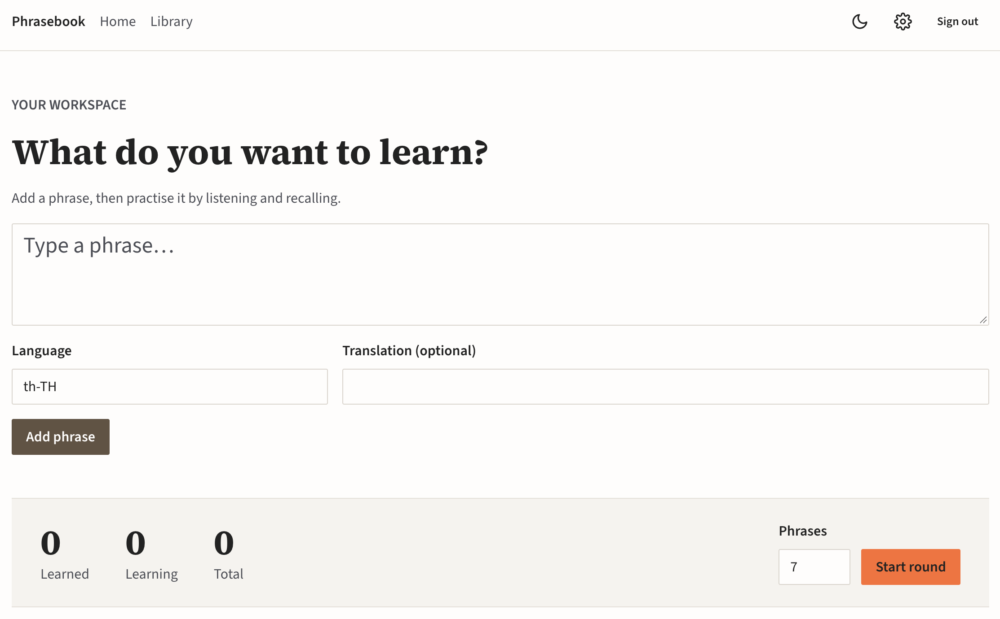

# Phrasebook - Audio-based language learning

---

## About

Prototype/experimental UI for an audio-based language learning app that focuses 
on nothing but your own content: audio voices and managing what you want to learn.

No schedules, algorithms, SRS, or gamification – just pure data. It’s up to you :)

---

## Rationale

Many apps I’ve tried over the years offer an abundance of chores and beautifications. 
These make the apps enjoyable, but they effectively hinder progress.

I’d just love to memorise and speak a language, not hand-draw 2,000 kanji or have to repeat 
variations of “Hello” a similar number of times. And I really don’t believe that tapping words 
on a phone to form a sentence would ever effectively teach us correct spelling or grammar.

Being forced into needless repetitions by algorithms we don’t control is hard to avoid. 
If the priority is listening and speaking, nothing else should get in the way.

---

## Disclaimer

This is an early-stage concept and demo to showcase an idea. 
It’s public, but not ready for it yet.

There is no refined UI/UX concept nor a quality audio engine behind the scenes yet. 
Lastly, there’s also the matter of data storage, privacy, and API/AI costs, 
which would take this to a whole different level of effort and responsibility.

I'd truly love to take this much much further, make it really practically useful, add more features.
Though due to time constraints, I'll resort to experimentation and exploration stages for now.

Feel free to use it as it is :)

---

_Please don't store sensitive data in an eventual account. No data is guaranteed to be persisted or saved over time. Features and availability might change at any time, without prior notice. Past data entries might be purged any time at own discretion._
